# img2threejs Plugin Wiki

Why the skill was refactored this way, how it works, how to write a plugin, how to change the
frame's behaviour, and what the frame refuses.

Single-page build of `docs/plugin-wiki/` — the wiki is the source, this is generated.

| page | read it when |
|---|---|
| [01 — Why, and what changed](#why-and-what-changed) | you want the motivation, or you are worried something was taken away |
| [02 — How it works](#how-it-works) | you need the architecture: resolution, splicing, the merge, the boundaries |
| [03 — Cookbook](#cookbook) | **you are building something.** Eleven worked scenarios, each with real files |
| [04 — Reference](#reference) | every field, every refusal, and the known gaps |

`PLUGIN_CONTRACT.md` is normative. Where a wiki page and the contract disagree, the contract wins.

### Start here: nothing was taken away

**If you use the base skill on its own, it does everything it did before.** Plugins are additive. There
is no reduced mode, no "community edition", no capability that got moved behind an install.

| | before | now, base alone |
|---|---|---|
| Reconstruct an arbitrary object from a reference image | yes | yes |
| The 21-step frame: intake → spec → build → review → rig | yes | yes |
| Strict spec validation, visual gates, correction loops with ceilings | yes | yes |
| Multi-angle review, detail inventory, material evidence | yes | yes |
| A **generic** (non-domain) object passes strict validation | **no — this was broken** | **yes** |

That last row is the one worth pausing on. The refactor did not trade capability for modularity; the
generic path did not exist before and now does. Previously every non-character kind fell through to the
weapon track, and that track failed strict validation unless the spec carried a domain marker — so a
plain hammer could not be built without pretending to be something it wasn't.

**What a plugin adds** is subject-specific rigour on top of the same frame: a declared intake contract
instead of an inference, a domain-specific blocking gate, a stricter quality floor, and reference
material the model reads before it starts. Same pipeline, better informed.

**What a plugin can never do** is make the frame looser. It cannot remove a gate, lower a floor,
reorder base steps, or substitute a base command. See [§ Changing behaviour](#scenario-4)
for what to do when that is what you were reaching for.

### Quick start

```bash
img2 add img2threejs/plugin-hello-cube    # the smallest complete example
img2 doctor                                # expect: ok (N plugins, 0 warnings)
img2 add --link ./my-plugin                # develop against a local checkout, no clone
```

Then read [the cookbook](#cookbook) — it is organised by what you are trying to do, not by which
file a field lives in.

---

## Why, and what changed

### The problem: fused, not layered

The skill and its first subject area were not layered — they were **fused**. Four concrete symptoms:

**A pipeline picked itself from a filename.** Domain recognition matched the target's *name*. A file
called `karambit-doppler.png` selected one pipeline; `kitchen-knife.png` selected another. Name
similarity is now explicitly banned as a resolution input precisely because it fails silently and
cannot be reasoned about.

**There was no generic path.** Every non-character kind fell through to the weapon track, and that track
failed strict validation unless the spec carried a domain marker. A plain hammer could not be
reconstructed without pretending to be a CS2 skin. "Generic" was not a working path — it was a hole.

**Base code held domain knowledge it had no business holding.** A bone-track domain set inside the
emitter, a 36-line domain quality gate inside the base validator, and a single conditional keyed on
*two* domain names at once (`elif is_character and is_cs2`). That last one is the shape of the whole
problem: a third domain would not have added a branch, it would have multiplied them.

**One subject area owned 34 files** in a repo meant to serve all of them.

### Why that is a correctness problem, not a tidiness problem

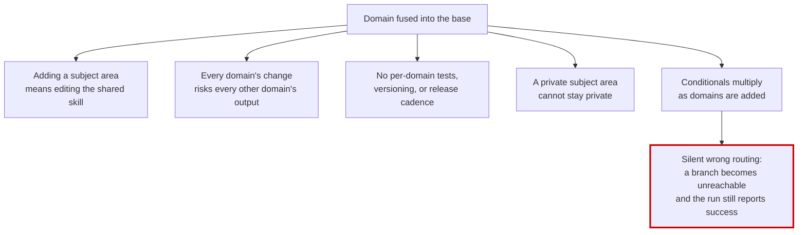

When two domains are entangled in one conditional, removing either leaves the other **unreachable or
wrongly reached** — and the run still exits 0 with a plausible answer. That is the failure mode that
makes this structural rather than cosmetic.

**Why not a bigger switch statement, or config flags?** Because that is what the combined conditional
already was, and its failure mode is silence. A flag-driven frame grows combinatorially in the number of
domains, and each new combination is a branch nobody tested. A frame that knows *no* domain has one path
to test, and each domain tests itself in its own repo.

### What the refactor buys

| | |
|---|---|
| A subject area is a **repo**, not a patch to a shared file | it can be private, versioned, released on its own cadence |
| The base has **one job** | reconstruct a reference image into procedural TypeScript, knowing no domain |
| With **no plugin** the frame still completes | it infers from the image — a plugin is optional, not load-bearing |
| A plugin can make the frame **stricter or better-informed** | never looser or different |
| Resolution is by **declared typed edge** | no name matching; ambiguity is refused, not guessed |

### What was *not* traded away

See the table in the [index](#start-here-nothing-was-taken-away). The short version: no
capability moved behind an install, and the generic path is strictly better than before — it now exists.

What moved out is **subject-specific knowledge**, and it comes back with one `img2 add`.

### The three decisions the architecture rests on

1. **One entry point.** There is a single base skill. Plugins do not add entry points; they add
   capability to the one that exists.
2. **Each plugin is its own repo**, installed by a single command, with its own tests that pass without
   the base test tree.
3. **The base pulls; a plugin never pushes.** A plugin publishes declarations and artifacts. The base
   reads them at points it chooses. This is what makes "no plugin installed" a working path rather than a
   broken one.

The consequence worth stating plainly: **installing a plugin never changes a pipeline behind your
back.** A plugin adds steps and gates and raises quality floors. It cannot replace or remove anything.
Replacing is a user action, not a plugin action — see
[Scenario 4](#scenario-4).

---

## How it works

Diagram conventions: **solid** = available · **dashed** = coming, do not depend on it yet · **thick
red** = no mechanism or a known gap.

### Repo topology

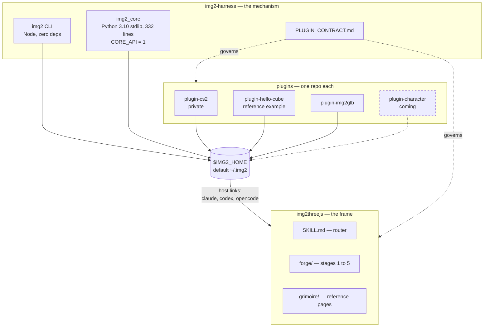

The harness ships **no domain capability** and the base **names no domain** — so adding a subject area
is adding a repo, not editing two.

### `$IMG2_HOME`, install, and the trust boundary

```
$IMG2_HOME/                  (default ~/.img2)
├── harness/                 the CLI + img2_core, as installed
├── plugins/<name>/          one directory per installed plugin
├── plugins.json             the registry — what is active, and user-owned overrides
├── receipts.json            what was installed, from which ref and sha
└── backups/                 pre-change copies
```

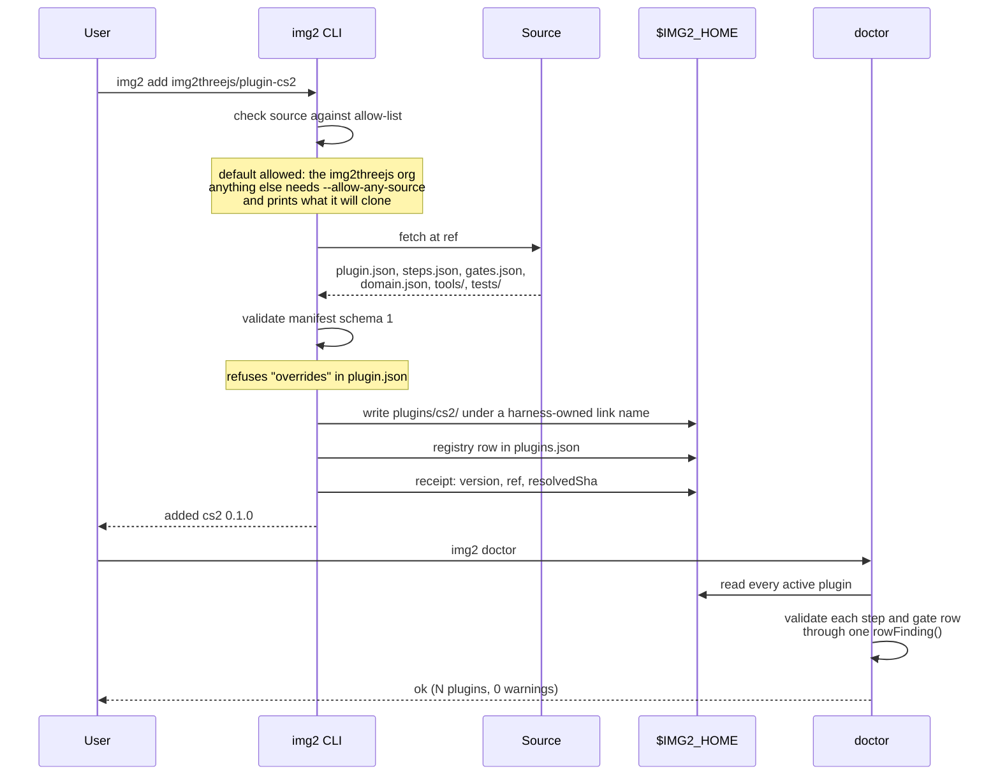

**The threat model, stated honestly in the contract**: a plugin is arbitrary code the agent will later
execute in your workspace. `add` pins (`resolvedSha`), attributes (registry row), and links under a
harness-owned name — *"it cannot make the code safe, only make what runs identifiable and
reproducible."* The harness **never runs plugin tests or imports plugin code** during `add`, `doctor` or
`sync`; validation is static.

`doctor` and the capability query validate rows through **the same function**, `rowFinding()`, so they
cannot drift apart. They once did: the query answered `exit 0` with `problems: []` while handing back a
row whose `argv[0]` was the prose word `Read` — which resolves on a case-insensitive filesystem to
`/usr/bin/read` and exits 0. That silent-success path is why `argv[0]` of a `program` row must be a path
form or one of `python3 python node bash sh`.

### Capability resolution — typed edge, never name

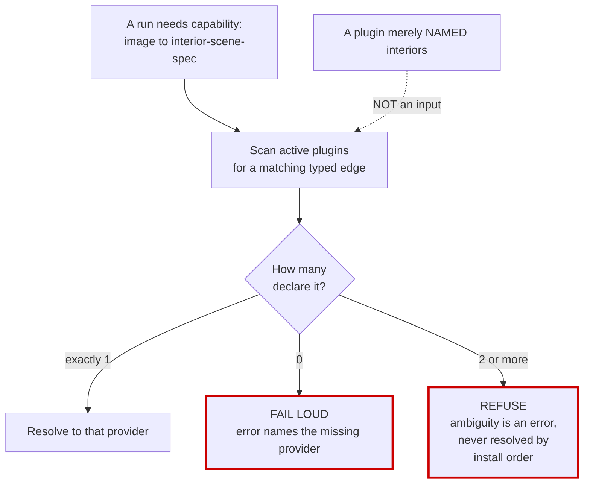

No domain at all is a **valid state**, not an error. Only an *explicit* request for a domain with no
provider fails. A provider declaring several capabilities draws a `doctor` WARN naming the plugin and
its count — visible, but not an error.

### The extension surface

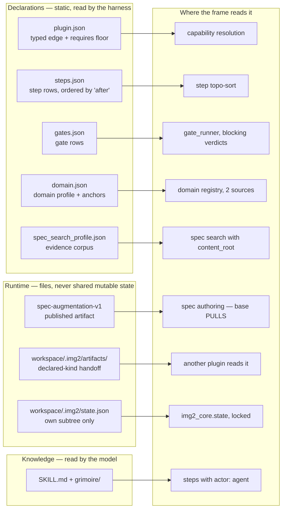

The **domain registry** has exactly two sources: in-repo modules, and installed plugins' `domain.json`
read **through the harness registry** — never by globbing a directory. Ambiguity between the two is
refused rather than resolved by precedence.

### Runtime — one run, three cases

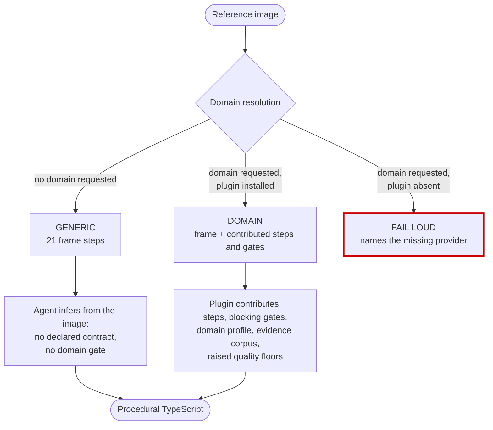

The two paths that produce output differ in **exactness, not completeness**. Generic finishes — and
preserving that is on you: a plugin that makes the generic path stop working has broken the frame's
first principle.

### Where a plugin splices in

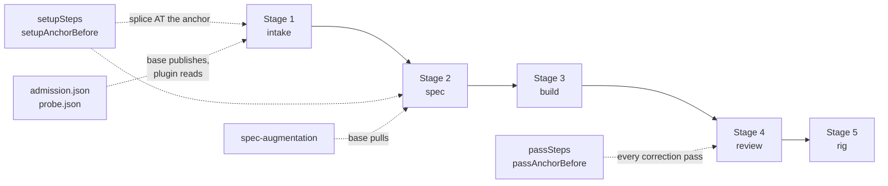

Splicing inserts your steps **immediately before** the anchored base step. An anchor naming a base step
that does not exist fails loud — the alternative, appending at the end, would put a setup step after the
steps that depend on it. Step ids to anchor against are listed in
[the cookbook](#anchors).

### The augmentation merge, and every refusal

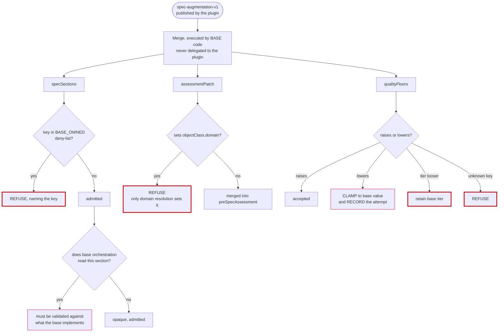

`BASE_OWNED` = `qualityContract`, `preSpecAssessment`, `pipelineRouting`, `sourceImage`, `targetName`,
`localSpecSearch`. **Raise-only is the security property**, stated in the module itself: *a plugin must
never be able to lower the bar it was installed to raise.*

### Boundaries — who may read, import, write

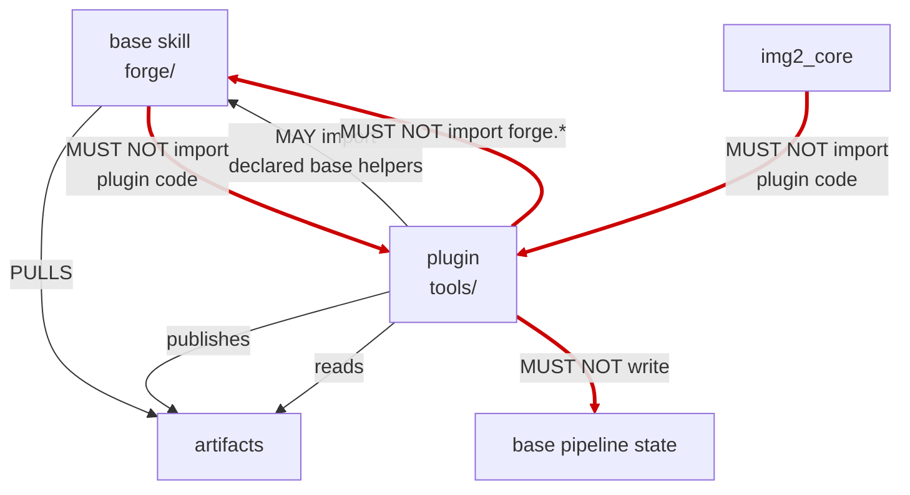

**Gap — the base-import prohibition is not in the contract yet.** The only `MUST NOT import` clause
binds *plugin tools* and *`img2_core`*; none binds the base itself. The thick edge from `base` to
`plugin` is the rule the architecture assumes and the document does not yet state. See
[gaps](#gaps).

### Workspace state — one file per owner

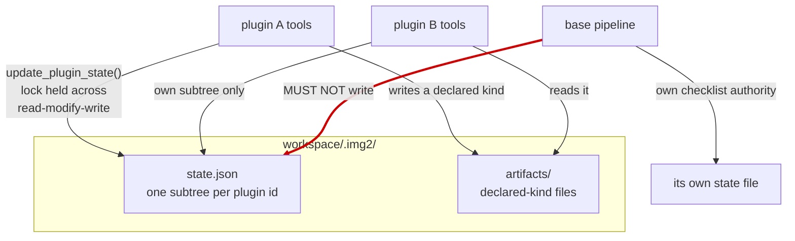

The base pipeline is **not** a plugin: it has no `_img2_local.py`, cannot import `img2_core`, and must
not write `state.json`. Its own delegation record belongs in its own state file.

---

## Cookbook

Organised by what you are trying to do. Every anchor id, field name and file name below is real — the
base pipeline's step ids are listed in [§ Anchors](#anchors) so you can point at them.

| # | I want to… | short answer |
|---|---|---|
| [1](#scenario-1) | add a whole new subject area | a new plugin repo with `domain.json` |
| [2](#scenario-2) | insert a step **before** an existing base step | `setupAnchorBefore` / `passAnchorBefore` |
| [3](#scenario-3) | add a blocking check of my own | `gates.json` + a verdict envelope |
| [4](#scenario-4) | **override / remove a base gate** | you cannot — three things to do instead |
| [5](#scenario-5) | only raise a quality bar, no new code | `qualityFloors` in the augmentation artifact |
| [6](#scenario-6) | run a step in **every correction pass** | `passSteps`, not `setupSteps` |
| [7](#scenario-7) | ship knowledge, not code | an `actor: agent` step + a grimoire page |
| [8](#scenario-8) | contribute reference material to search | `spec_search_profile.json` + `content_root` |
| [9](#scenario-9) | hand data to another plugin | a declared-`kind` file in `artifacts/` |
| [10](#scenario-10) | add a capability the frame has no opinion about | a typed edge + one step |
| [11](#scenario-11) | develop locally / keep it private | `img2 add --link`, a private repo |

---

<a name="scenario-1"></a>
### Scenario 1 — Add a whole new subject area: houses & interiors

You reconstruct rooms and furniture. The frame can already build an arbitrary object from an image, but
it has no idea that a room has a floor plane, that a doorway is ~2 m, or that a sofa's seat height is a
strong scale cue. You want those to be a **declared contract** rather than something the model
re-derives every run.

#### The repo

```
plugin-interiors/
├── plugin.json                     required
├── domain.json                     the domain profile: steps + anchors + corpus
├── gates.json                      a blocking scale-plausibility check
├── spec_search_profile.json        your reference corpus
├── steps.json                      (optional — see the note below)
├── SKILL.md                        what the model should know about you
├── grimoire/
│   └── intake/interior_contract.md the page your agent step points at
├── tools/
│   ├── interior_manifest.py
│   ├── emit_spec_augmentation.py
│   └── scale_plausibility.py
└── tests/
    ├── test_manifest.py
    └── test_suite_integrity.py
```

#### `plugin.json`

```json
{
  "schema": 1,
  "name": "interiors",
  "version": "0.1.0",
  "description": "Rooms, built-ins and furniture: room-scale contract, scale-cue extraction, material recipes for architectural surfaces, and a blocking scale-plausibility gate.",
  "capabilities": [
    { "from": "image", "to": "interior-scene-spec" }
  ],
  "requires": { "harness": ">=0.2.1", "coreApi": 1 }
}
```

`capabilities` is the **only** thing resolution matches on. Naming the plugin `interiors` does not make
it resolve for interiors — the typed edge does. Two plugins declaring the same edge is refused, not
ranked.

#### `domain.json` — the part that actually splices into the pipeline

```json
{
  "id": "interiors",
  "setupSteps": [
    ["interiors-contract-read",
     "Read {plugin_dir}/grimoire/intake/interior_contract.md completely before writing the manifest"],
    ["interiors-scale-cues",
     "Identify every scale cue visible in the reference (doorway, step riser, outlet, seat height) and record it in scale-cues.json"],
    ["interiors-manifest",
     "python3 {plugin_dir}/tools/interior_manifest.py {reference} --scale-cues scale-cues.json --admission admission.json --probe probe.json --out interior-intake.json"],
    ["interiors-spec-augmentation",
     "python3 {plugin_dir}/tools/emit_spec_augmentation.py --manifest interior-intake.json --out spec-augmentation.json"]
  ],
  "setupAnchorBefore": "local-spec-search",
  "passSteps": [
    ["interiors-scale-review",
     "python3 {plugin_dir}/tools/scale_plausibility.py --spec object-sculpt-spec.json --manifest interior-intake.json --out interiors-review.json"]
  ],
  "passAnchorBefore": "ai-review-recorded",
  "specCollection": "interiors"
}
```

**Why `local-spec-search` is the right anchor.** Your four steps land immediately *before* it, which
puts them after `reference-admission` (so `admission.json` and `probe.json` exist for your manifest to
read) and before `pre-spec-assessment` and `spec-authoring` (so the assessment sees your contract and
spec authoring can pull your `spec-augmentation.json`). Pick an anchor by asking **what must already
exist** and **what must see your output** — not by where it looks tidy.

The registry validates the profile: unknown keys are refused, and `setupSteps` without
`setupAnchorBefore` is an error. An anchor naming a base step that does not exist **fails loud**:

```
WorkflowStateError: profile 'interiors' anchors a step before unknown base step 'vision-analysis'
```

That is deliberate. The alternative — appending at the end — would put your setup step *after* the
steps that depend on it, and the run would fail somewhere confusing instead of here.

#### `domain.json` vs `steps.json` — which one?

Both contribute steps, and they are not interchangeable:

| | `domain.json` (`setupSteps` / `passSteps`) | `steps.json` |
|---|---|---|
| ordering primitive | `setupAnchorBefore` / `passAnchorBefore` — a **base** step id | `after: [step-id]` — another **contributed** step id |
| positions relative to base steps | **yes** — that is its whole job | no |
| runs only when your domain is resolved | yes | no, it is active whenever the plugin is |
| use it for | subject-specific work that must sit at a precise point in the pipeline | a capability that is not domain-gated |

For a subject area you want `domain.json`. Use `steps.json` when your step should run regardless of
which domain resolved — see [Scenario 10](#scenario-10).

#### What the frame does with it

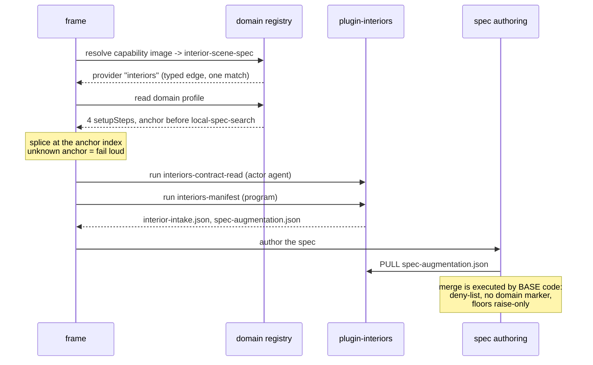

#### Verify it before you trust it

```bash
img2 add --link ./plugin-interiors
img2 doctor                    # zero findings, or fix and repeat
python3 -m pytest tests -q     # your suite, standalone, no base test tree

# the important one — the frame must still work WITHOUT you:
IMG2_HOME=$(mktemp -d) python3 -m unittest discover -s forge/tests -p 'test_*.py'
```

That last command is not a formality. A plugin that makes the generic path stop working has broken the
frame's first principle, and it is the single easiest thing to break by accident.

---

<a name="scenario-2"></a>
### Scenario 2 — Insert a step *before* an existing base step

This is the question people ask most, and the answer depends on which "before" you mean.

#### Before a **base** step → `setupAnchorBefore` / `passAnchorBefore`

Splicing is by anchor, and the anchor means *immediately before this base step*.

```json
{
  "id": "interiors",
  "setupSteps": [["interiors-scale-cues", "…"]],
  "setupAnchorBefore": "image-analysis"
}
```

That lands your step before the very first base step. Common anchors and what they buy you:

| you want to run… | anchor |
|---|---|
| before anything else, including the reference read | `image-analysis` |
| after admission, before local search / assessment / authoring | `local-spec-search` |
| right before the spec is authored | `spec-authoring` |
| right before strict validation | `strict-validation` |
| before the AI vision review, on **every** correction pass | `ai-review-recorded` (in `passSteps`) |
| before the pass gate decides, on every pass | `pass-gate-check` (in `passSteps`) |

#### Before another **contributed** step → `after` in `steps.json`

`after` expresses only "after X", so you order your own steps by making the later one depend on the
earlier:

```json
[
  { "id": "my-fetch",   "title": "…", "actor": "program", "command": "…", "after": [] },
  { "id": "my-analyse", "title": "…", "actor": "program", "command": "…", "after": ["my-fetch"] }
]
```

`after` may name **another plugin's** step id — that is supported and is how two plugins cooperate. A
cycle or an unknown reference is a `doctor` error, never a guessed order.

#### What you cannot do

There is **no `before` field** in `steps.json`, and no way for a plugin to make a *base* step depend on
a contributed one. If you need to run before a base step, use the anchor. If the base step you need to
precede is inside a phase you have no anchor into, say so in an issue — do not try to fake it with
ordering tricks.

---

<a name="scenario-3"></a>
### Scenario 3 — Add a blocking check of my own

A gate is a CLI: input by argv, exactly **one** verdict envelope on stdout.

#### `gates.json`

```json
[
  {
    "id": "interiors-scale-plausible",
    "command": "python3 {plugin_dir}/tools/scale_plausibility.py --spec object-sculpt-spec.json --manifest interior-intake.json",
    "blocking": true,
    "after": []
  }
]
```

#### The tool

```python
#!/usr/bin/env python3
"""Refuse a scene whose derived scale contradicts its own scale cues."""
import argparse, json, sys

def main() -> int:
    ap = argparse.ArgumentParser()
    ap.add_argument("--spec", required=True)
    ap.add_argument("--manifest", required=True)
    ap.add_argument("--workspace", default=".")     # never the checkout root
    args = ap.parse_args()

    reasons = []
    try:
        spec = json.load(open(args.spec))
        manifest = json.load(open(args.manifest))
    except (OSError, json.JSONDecodeError) as exc:
        # could not evaluate -> error, NOT a fail, NOT a pass
        print(json.dumps({
            "kind": "img2.gate-verdict", "version": 1,
            "gate": "interiors-scale-plausible", "plugin": "interiors",
            "status": "error", "reasons": [f"unreadable input: {exc}"], "evidence": {},
        }))
        return 2

    doorway = manifest.get("scaleCues", {}).get("doorwayHeightM")
    derived = spec.get("sceneScale", {}).get("doorwayHeightM")
    if doorway and derived and abs(derived - doorway) / doorway > 0.15:
        reasons.append(f"doorway height {derived} m contradicts the measured cue {doorway} m by >15%")

    status = "pass" if not reasons else "fail"
    print(json.dumps({
        "kind": "img2.gate-verdict", "version": 1,
        "gate": "interiors-scale-plausible", "plugin": "interiors",
        "status": status, "reasons": reasons,
        "evidence": {"measured": doorway, "derived": derived},
    }))
    return 0 if status == "pass" else 1

if __name__ == "__main__":
    sys.exit(main())
```

Three rules that decide whether your gate is trustworthy:

- **Exit code carries the verdict**: `0` pass, `1` fail (evaluated, verdict negative), `2` error or
  refused (could not evaluate). Do not conflate 1 and 2 — "the check says no" and "the check could not
  run" are different facts, and only the second means your gate is broken.
- **A malformed envelope is an `error`, not a pass.** This is what stops a crashed gate from reading as
  green. Do not add a `try/except` that swallows a failure and prints `pass`.
- **`reasons` must be non-empty when `status` is not `pass`.** A refusal with no reason is unactionable.

`blocking: true` stops the workflow. `blocking: false` records the verdict and continues — use it while
you are still calibrating.

---

<a name="scenario-4"></a>
### Scenario 4 — "I want to override / remove a base gate"

**You cannot, and this is deliberate.** The reasoning is one sentence: if a plugin could override a
gate, then *installing a plugin could switch off a quality check and nothing would say so.* The contract
states the consequence directly — *"installing or upgrading a plugin therefore never changes a
pipeline."*

| | |
|---|---|
| Plugin replaces a base step or gate | **No** |
| Plugin declares an override about itself or another plugin | **No** — `plugin.json` has no override field and MUST NOT gain one |
| User replaces a step or gate | reserved as `overrides` in `plugins.json` — **not implemented** |
| Harness behaviour today | refuses `overrides` in a plugin manifest; a harness that does not implement the mechanism must FAIL on the key, never proceed as if the pipeline were unmodified |

Even once implemented, two rules are already fixed: an override value is a **reference to an existing
row, never an inline command** (an inline command would bypass the placeholder and metacharacter
checks), and `overrides` is **user-owned data** that any registry-rewriting command must preserve
verbatim and report.

#### What to do instead

Almost every real "I need to override the gate" turns out to be one of these three:

**(a) The base gate is not the check I need → add yours alongside.** Both run. Yours can be stricter,
subject-specific, and blocking. The base gate is not in your way; it is checking something else.

**(b) The base threshold is too lax for my subject → raise the floor.** See
[Scenario 5](#scenario-5). Raise-only, recorded, attributed to your plugin and version.

**(c) The base step improvises badly for my subject → contribute a step with a declared contract.** The
frame defers to a declared contract over its own inference. You are not replacing the step; you are
removing the need for it to guess.

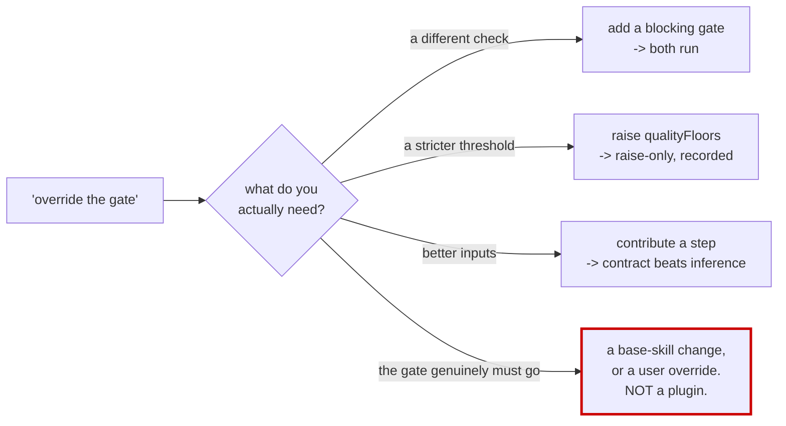

If it really is (d) — the gate must not exist for anyone — that is a change to the base skill. Open an
issue arguing why. Routing around a gate from a plugin is the one thing this architecture is built to
prevent.

---

<a name="scenario-5"></a>
### Scenario 5 — Only raise a quality bar, no new steps or gates

Publish a `spec-augmentation-v1` artifact carrying just `qualityFloors`. The base **pulls** it during
spec authoring; the merge runs in base code and is never delegated to you.

```json
{
  "kind": "spec-augmentation-v1",
  "provider": "interiors",
  "version": "0.1.0",
  "qualityFloors": {
    "targetMinDetails": 24,
    "strictnessTier": "complex"
  }
}
```

What the merge does with it:

| you propose | result |
|---|---|
| a number **above** the base value | accepted |
| a number **below** the base value | **clamped to the base value, and your attempt is recorded** |
| a tier **stricter** than the base | accepted |
| a tier **looser** than the base | base tier retained |
| a key the base does not know | **refused**, naming the key |

Tier order, loosest to strictest: `simple → moderate → complex → ultra-complex`.

Every accepted change is attributed to the provider and version that proposed it, so a run's quality bar
can be explained afterwards instead of inferred from whatever happens to be installed.

Two things the artifact may **not** carry: any key in `BASE_OWNED` (`qualityContract`,
`preSpecAssessment`, `pipelineRouting`, `sourceImage`, `targetName`, `localSpecSearch`) inside
`specSections`, and `objectClass.domain` via `assessmentPatch` — only domain resolution sets that.

---

<a name="scenario-6"></a>
### Scenario 6 — Run a step in every correction pass

`setupSteps` run **once**. `passSteps` run **in every correction pass** — which is what you want for a
review or measurement that has to be re-taken after each correction.

```json
{
  "passSteps": [
    ["interiors-scale-review",
     "python3 {plugin_dir}/tools/scale_plausibility.py --spec object-sculpt-spec.json --out interiors-review.json"]
  ],
  "passAnchorBefore": "ai-review-recorded"
}
```

Put it before `ai-review-recorded` when your measurement should inform the AI review, or before
`pass-gate-check` when it should inform the continue/stop decision.

Correction loops have ceilings the base counts from the spec's own review history — `maxPerPass` and
`maxTotal`. On breach the run reports `status: stopped` with a `stopReason` and exits non-zero. **A
plugin does not get to raise these.** If your subject genuinely needs more passes, that is a
conversation about the base's ceilings, not a value you can set.

---

<a name="scenario-7"></a>
### Scenario 7 — Ship knowledge, not code

The most under-used extension point. A plugin can contain **zero executable tools** and still be
valuable: one `actor: agent` step plus a reference page.

```json
{
  "setupSteps": [
    ["interiors-contract-read",
     "Read {plugin_dir}/grimoire/intake/interior_contract.md completely before writing the manifest"]
  ],
  "setupAnchorBefore": "local-spec-search"
}
```

`actor: agent` means the row is an instruction to the model, not a command. It is returned as an
`instruction` with **no `argv` key at all**, and nothing is executed — so the `argv[0]` and
metacharacter rules do not apply.

**Set `actor` explicitly on every prose row.** The default is `program`, and a prose sentence handed to
an executor is how `Read the contract` once resolved to `/usr/bin/read` on a case-insensitive filesystem
and exited 0 — a silent success that looked like a completed step. An unknown `actor` is refused, not
defaulted.

This is how `plugin-cs2` starts: its first contributed step's entire job is *"read this contract page
completely before creating or validating the manifest."*

---

<a name="scenario-8"></a>
### Scenario 8 — Contribute reference material to spec search

```json
{
  "id": "interiors",
  "collections": [
    {
      "name": "interiors",
      "content_root": "{plugin_dir}/corpus",
      "include": ["**/*.md", "**/*.json"]
    }
  ]
}
```

and in `domain.json`: `"specCollection": "interiors"`.

`content_root` names a second permitted root the registry vouched for. The containment guard still
applies: no absolute paths, no `..`, and an `lstat` per path component. You are widening *where* the
base may read, not disabling the check that it stays inside.

Use this when your subject has canonical reference material — dimension standards, material catalogues,
naming conventions — that a step should search rather than a model should recall.

---

<a name="scenario-9"></a>
### Scenario 9 — Hand data to another plugin

Cross-plugin handoff is **files with declared `kind` identifiers** in `<workspace>/.img2/artifacts/` —
never shared mutable state.

```python
# plugin A writes
artifact = {"kind": "interiors.room-envelope-v1", "version": 1, "rooms": [...]}
(workspace / ".img2" / "artifacts" / "room-envelope.json").write_text(json.dumps(artifact))
```

```python
# plugin B reads — and checks the kind, because a file name is not a contract
data = json.loads(path.read_text())
if data.get("kind") != "interiors.room-envelope-v1":
    raise SystemExit(f"unexpected artifact kind: {data.get('kind')!r}")
```

For your **own** state, `<workspace>/.img2/state.json` has one subtree per plugin id, and you touch only
yours:

```python
from img2_core.state import update_plugin_state
update_plugin_state(workspace, "interiors", lambda s: {**s, "roomsMeasured": 4})
```

Mutate **only** through `update_plugin_state`, which holds the lock across the whole
read-modify-write. A separate load → mutate → save with the lock held only at save is a lost-update bug,
and the contract names it as one.

Tools take `--workspace`, defaulting to cwd — **never** the skill or checkout root. A tool that writes
into the checkout is writing into somebody's git working tree.

---

<a name="scenario-10"></a>
### Scenario 10 — Add a capability the frame has no opinion about

Not every plugin is a subject area. `plugin-img2glb` is the shape here: it adds an ability the frame
never had and that no domain gates.

Use `steps.json` rather than `domain.json`, because the step should run whenever the plugin is active
rather than only when a domain resolves:

```json
[
  {
    "id": "glb-export",
    "title": "Export the built factory to GLB",
    "actor": "program",
    "command": "node {plugin_dir}/tools/export_glb.mjs --workspace {workspace} --out export.glb",
    "after": []
  }
]
```

Declare a typed edge that says what you convert:

```json
"capabilities": [{ "from": "threejs-factory", "to": "glb-asset" }]
```

---

<a name="scenario-11"></a>
### Scenario 11 — Develop locally, and keep it private

```bash
img2 add --link ./plugin-interiors     # symlink a local checkout; no clone
img2 doctor                             # iterate until zero findings
img2 remove interiors                   # deletes the row, and any user overrides on it
```

**Private is a first-class case.** `plugin-cs2` is a private repo, and nothing in the frame requires a
plugin to be public — that was one of the reasons for the split. Installing from outside the default
`img2threejs` org needs `--allow-any-source`, which prints what it is about to clone before it does.

The harness **never runs your tests or imports your code** during `add`, `doctor` or `sync` — validation
is static. What `add` does give you is provenance: a pinned `resolvedSha`, a registry row, and a link
under a harness-owned name. The contract is honest about the limit: *"it cannot make the code safe, only
make what runs identifiable and reproducible."*

---

<a name="anchors"></a>
### Anchors — the base pipeline's step ids

Splice targets for `setupAnchorBefore` and `passAnchorBefore`. An anchor outside this list fails loud.

**Setup phase, runs once (11):**

`image-analysis` → `reference-suitability` → `reference-admission` → `local-spec-search` →
`pre-spec-assessment` → `detail-inventory` → `projection-route` → `spec-authoring` →
`material-evidence` → `material-spec-wiring` → `strict-validation`

**Correction pass, runs every pass (8):**

`build-current-pass` → `render-capture` → `review-contract-read` → `tier1-diagnostics` →
`multi-angle-review` → `pass-gate-check` → `ai-review-recorded` → `pipeline-sync`

**Final (2):** `part-coverage` → `action-ready`

21 steps generic; contributed steps add to that count rather than replacing any of it.

---

### Anything else?

Cases this cookbook does **not** cover, because there is no mechanism:

| you want | status |
|---|---|
| remove or replace a base step or gate | no mechanism — [Scenario 4](#scenario-4) |
| reorder base steps among themselves | no mechanism |
| two plugins providing the same typed edge | refused as ambiguous, by design |
| raise the correction-loop ceilings | not a plugin-settable value |
| make the base import your code | forbidden; the base pulls artifacts instead |
| a pass id outside the base's set | **accepted today, and it should not be** — see [gaps](#gaps) |

That last row is a live bug, not a feature: a pass named outside the base's set silently loses its
render, comparison and vision gate. Until it is fixed, do not name a pass outside the base's set — it
will look like it works.

---

## Reference

Every field, every refusal, the checklist, and the known gaps.

### `plugin.json` — the only required file

```json
{
  "schema": 1,
  "name": "interiors",
  "version": "0.1.0",
  "description": "One sentence on what this plugin knows and what it refuses.",
  "capabilities": [
    { "from": "image", "to": "interior-scene-spec" }
  ],
  "requires": { "harness": ">=0.2.1", "coreApi": 1 }
}
```

| field | notes |
|---|---|
| `schema` | manifest schema version. `1` today |
| `name` | `[a-z][a-z0-9-]*`. Becomes the registry id, the directory under `$IMG2_HOME/plugins/`, **and** the host link suffix (`~/.claude/skills/img2-<name>`) — you do not choose the link name |
| `description` | one line. Shown in `img2 list` and the generated index |
| `capabilities` | array of typed edges `{from, to}`. **The only thing resolution matches on.** Several edges draws a `doctor` WARN, not an error |
| `requires` | compatibility floor: `harness` semver range, `coreApi` integer. **A mismatch BLOCKS at `img2 add` and `img2 sync`** — pick honest floors. Only `>=X.Y.Z` parses; nothing else does |
| ~~`overrides`~~ | **must never exist.** Install fails if present |

### `domain.json` — the domain profile

Read through the harness registry, never by globbing.

| field | required | notes |
|---|---|---|
| `id` | yes | domain id |
| `setupSteps` | no | array of `[step_id, command]`; run **once** |
| `setupAnchorBefore` | **when `setupSteps` is non-empty** | base step id; your steps splice immediately *before* it |
| `passSteps` | no | array of `[step_id, command]`; run in **every correction pass** |
| `passAnchorBefore` | **when `passSteps` is non-empty** | base step id |
| `specCollection` | no | name of your contributed spec-search collection |

The registry refuses unknown keys, and refuses `setupSteps` without `setupAnchorBefore`. An anchor
naming a base step that does not exist fails loud:

```
WorkflowStateError: profile 'interiors' anchors a step before unknown base step 'vision-analysis'
```

Anchor ids: see [the cookbook](#anchors).

### `steps.json` — contributed steps, ordered among themselves

```json
[
  {
    "id": "interiors-contract-read",
    "title": "Read the interior intake contract completely",
    "actor": "agent",
    "command": "Read {plugin_dir}/grimoire/intake/interior_contract.md completely",
    "after": []
  }
]
```

| field | notes |
|---|---|
| `id` | unique across all active plugins |
| `title` | human-readable |
| `actor` | `program` (default) · `agent` · `human`. Unknown values are refused, not defaulted |
| `command` | see placeholders below |
| `after` | array of step ids; **may name another plugin's step**. A cycle or unknown ref is a `doctor` error |

#### `actor`

| `actor` | meaning | `argv[0]` rule | returned as |
|---|---|---|---|
| `program` | executable | must be a path form, or one of `python3 python node bash sh` — a bare word is refused | `argv` array |
| `agent` | an instruction to the model | not applicable, nothing is executed | `instruction`, **no `argv` key at all** |
| `human` | an instruction to a person | not applicable | `instruction` |

Set `actor` explicitly on every prose row. `program` is the default, and a prose sentence handed to an
executor is how `Read the contract` once resolved to `/usr/bin/read` and exited 0 — a silent success
that looked like a completed step.

#### Placeholders — a closed set

`{plugin_dir}` · `{workspace}` · `{image}`

Anything else, including any `<…>` pseudo-placeholder, fails `doctor`. `{plugin_dir}` is substituted per
token; `{workspace}` and `{image}` are left as their own single argv elements for the caller to replace
by value — never as a shell string, and never through a shell. Shell metacharacters in any step or gate
command are refused.

### `gates.json` — blocking verdicts

```json
[
  {
    "id": "interiors-scale-plausible",
    "command": "python3 {plugin_dir}/tools/scale_plausibility.py --spec object-sculpt-spec.json",
    "blocking": true,
    "after": []
  }
]
```

One verdict envelope on stdout:

```json
{
  "kind": "img2.gate-verdict",
  "version": 1,
  "gate": "interiors-scale-plausible",
  "plugin": "interiors",
  "status": "pass",
  "reasons": [],
  "evidence": {}
}
```

| exit | meaning |
|---|---|
| `0` | pass |
| `1` | fail — gate evaluated, verdict negative |
| `2` | error or refused — could not evaluate |

`reasons` must be non-empty when `status` is not `pass`. **A malformed envelope is an `error`, not a
pass** — the rule that keeps a broken gate from reading as green. `img2_core.gate_runner` aggregates
envelopes and stops the workflow on a blocking fail.

**The envelope's `status` and the exit code must agree.** A gate printing `status: "pass"` and exiting
`1`, or `status: "fail"` and exiting `0`, is downgraded to `error` — the runner checks
`returncode != EXPECTED_EXIT[status]` and does not take your word for either half.

Test through the real runner, not by calling your tool directly:

```bash
python3 -m img2_core.gate_runner --plugin-dir <your repo> --workspace <tmp>
```

### Tools — the bootstrap stanza, and what `doctor` greps for

Every tool opens with this stanza **verbatim** (contract §8). Copy it from
`plugin-hello-cube/tools/emit_cube.py` rather than retyping it:

```python
import os, sys
root = os.environ.get("IMG2_HOME")
if root: sys.path.insert(0, os.path.join(root, "harness"))
else:
    try: import _img2_local; sys.path.insert(0, _img2_local.CORE)
    except ImportError: sys.exit("img2: core not linked - run `img2 sync`")
from img2_core import require_core_api
require_core_api(1)
```

After it you have `img2_core`:

```python
from img2_core import state as core_state
from img2_core.paths import resolve_workspace

ws = resolve_workspace(args.workspace)
core_state.update_plugin_state(ws, PLUGIN_ID, lambda s: {**s, "lastRun": stamp})
```

Static rules `img2 doctor` enforces by grep — a violation fails the audit, it does not warn:

| Rule | Why |
|---|---|
| **stdlib only** in `tools/` | third-party is allowed only behind a lazily-imported, documented network or live path — never on the probe or test path |
| **no `Path(__file__).parents[N]`** root computation | it breaks the moment the plugin is linked rather than cloned |
| **never import another plugin** | there is no plugin-to-plugin API; hand off through an artifact |
| **never import harness internals beyond `img2_core`** | everything else is private and will move |
| **state mutations only through `update_plugin_state`** | the lock must be held across the whole read-modify-write |
| **outputs to `<workspace>/.img2/artifacts/<plugin-id>/`** | a per-plugin subdirectory, so two plugins cannot collide |
| **never write into any checkout** | that is somebody's git working tree |

### `SKILL.md`

YAML frontmatter plus a body. The **`description` is the only thing in the model's context at session
start**, so it decides whether your plugin is ever found. Write it as a trigger — what it does plus
when to use it, in concrete nouns:

```markdown
---
name: img2-glb2threejs
description: Converts a GLB mesh into procedural Three.js code. Use when the user has a .glb file and wants editable Three.js geometry.
---
Body: the exact commands the model should run.
```

Commands in the body use the **`$SKILL_DIR` convention** — an absolute tool path, with the user's
project as the workspace:

```bash
python3 "$SKILL_DIR/tools/my_tool.py" --image <path/to/image> --workspace "$PWD"
```

State in the body that `$SKILL_DIR` is the directory containing that `SKILL.md`. A bare relative path
(`python3 tools/my_tool.py`) **fails**: the model runs commands from the user's project, where `tools/`
does not exist.

### `spec-augmentation-v1` — the pulled artifact

Three partitions, three authority rules:

| partition | rule |
|---|---|
| `specSections` | refused if the key is in `BASE_OWNED`. A section base orchestration reads must be validated against what the base implements, not admitted opaquely |
| `assessmentPatch` | merged into `preSpecAssessment`; **refused** if it sets `objectClass.domain` |
| `qualityFloors` | **raise-only.** Numbers clamp to the max and the attempt is recorded; tiers move only stricter; unknown keys refused |

`BASE_OWNED` = `qualityContract` · `preSpecAssessment` · `pipelineRouting` · `sourceImage` ·
`targetName` · `localSpecSearch`

Tier order, loosest → strictest: `simple` → `moderate` → `complex` → `ultra-complex`

Every accepted change is attributed to the provider and version that proposed it.

### Workspace state

| | |
|---|---|
| location | `<workspace>/.img2/state.json` |
| shape | `{version, workspace, plugins: {"<id>": {…}}}` — one subtree per plugin |
| mutation | **only** `img2_core.state.update_plugin_state(workspace, plugin_id, fn)`, which holds the lock across the whole read-modify-write |
| your outputs | `<workspace>/.img2/artifacts/<plugin-id>/` — a per-plugin subdirectory, so two plugins cannot collide |
| cross-plugin | files under `<workspace>/.img2/artifacts/` with declared `kind` identifiers — never shared mutable state |
| `--workspace` | tools take it, defaulting to cwd — **never** the skill or checkout root |

A separate load → mutate → save with the lock held only at save is a lost-update bug, and the contract
names it as one. The base pipeline must not write this file at all.

<a name="refusals"></a>
### Everything the harness refuses

| You do this | Result |
|---|---|
| `overrides` in `plugin.json` | install fails |
| `argv[0]` is a bare word on a `program` row | `doctor` FAILs |
| a placeholder outside `{plugin_dir} {workspace} {image}` | `doctor` FAILs |
| a `<…>` pseudo-placeholder | `doctor` FAILs |
| a shell metacharacter in any step or gate command | refused |
| unknown `actor` | refused, not defaulted |
| `after` names an unknown step, or forms a cycle | `doctor` error — never a guessed order |
| `setupSteps` without `setupAnchorBefore` | registry error |
| an anchor naming a base step that does not exist | fails loud, naming the anchor |
| an unknown key in `domain.json` | registry error |
| a declared file that does not exist | `doctor` FAILs |
| `_img2_local.py` not covered by `.gitignore` | `doctor` FAILs |
| two plugins declare the same typed edge | resolution refuses; never broken by install order |
| several capabilities in one plugin | WARN naming the plugin and its count — not an error |
| import `forge.*` from plugin tools | static boundary grep fails |
| a `requires` floor the installed harness does not meet | **blocks** at `img2 add` and `img2 sync` |
| a `requires` range that is not `>=X.Y.Z` | does not parse |
| a non-stdlib import in `tools/` on the probe or test path | `doctor` FAILs |
| `Path(__file__).parents[N]` root computation | `doctor` FAILs |
| importing another plugin, or a harness internal beyond `img2_core` | `doctor` FAILs |
| gate envelope `status` disagreeing with the exit code | downgraded to `error` |
| `assessmentPatch` sets `objectClass.domain` | merge refuses |
| `qualityFloors` lowers a floor | clamped to the base value, attempt recorded |
| `specSections` carries a `BASE_OWNED` key | merge refuses, naming the key |
| gate prints a malformed envelope | `error`, not a pass |
| write outside your own `state.json` subtree | contract violation |
| generated index out of sync | `img2 sync --check` exits non-zero |
| install from outside the default org | needs `--allow-any-source`, which prints what it will clone |

### Checklist for a new plugin

- [ ] `plugin.json` with a typed `capabilities` edge and a `requires` floor
- [ ] Every step and gate passes `img2 doctor` with zero findings
- [ ] `actor` set explicitly on every prose row — never rely on the `program` default
- [ ] No import of `forge.*` anywhere in `tools/`
- [ ] Tools take `--workspace`, defaulting to cwd — never the checkout root
- [ ] State mutation goes through `update_plugin_state`, not load → mutate → save
- [ ] Cross-plugin handoff is a declared-`kind` file in `artifacts/`, not shared state
- [ ] Own test suite passes **standalone**, without the base test tree
- [ ] A `test_suite_integrity.py` asserting the **collected** count against a recorded floor — a single
      indentation error once silently dropped three tests, and only counting caught it
- [ ] If you raise floors, verify each change is recorded with the provider and version
- [ ] With the plugin **absent**, the base still completes generically, and an explicit request for your
      domain fails loud naming the missing provider

### Verifying end to end

```bash
img2 add --link ./my-plugin      # develop against a local checkout, no clone
img2 doctor                      # expect: ok (N plugins, 0 warnings)
img2 sync --check                # generated index in sync; non-zero on drift

# the base must still pass with NO plugins installed:
IMG2_HOME=$(mktemp -d) python3 -m unittest discover -s forge/tests -p 'test_*.py'
```

Two measurement rules, both learned by getting them wrong:

- **Assert `collected`, never the run count.** The run/skipped split depends on which optional
  toolchains are present, so the same tree yields different splits on different machines. Collected is a
  property of the tree.
- **Never read a test's own stdout as a verdict.** A test exercising a failure path prints its own
  `FAILED:` line at column 0. Anchor on `Ran N tests` and the line after it, or use the exit code.

<a name="gaps"></a>
### Known gaps

1. **Pass-id authority — a live gate bypass.** The permitted pass-id set is *defined* in the validator
   and that definition is its **only occurrence**. Nothing checks a spec's `passOrder` or `buildPasses`
   against it — only their self-consistency. Pass ids are the keys the base's visual gates are indexed
   by, so a pass named outside the base's set silently loses its render, comparison and vision gate.
   **Until this is closed, do not name a pass outside the base's set — it will look like it works.**
2. **No contract clause binds the base** from importing plugin code. The only `MUST NOT import` clause
   binds plugin tools and `img2_core`.
3. **A domain whose emitter output differs structurally** — one needing the base to emit a different
   *class* of object rather than different values — has no declared mechanism yet.
4. **`overrides` has no mechanism**, so there is no supported way to replace a base step or gate. See
   [Scenario 4](#scenario-4).
5. **Reference-asset rules straddle the boundary.** The GLB probe and node-labeller are base tools while
   subject-specific GLB pipelines are not; ownership of the `no-baseline-assets` rule is unassigned. If
   your plugin consumes an external mesh, read that rule first.
