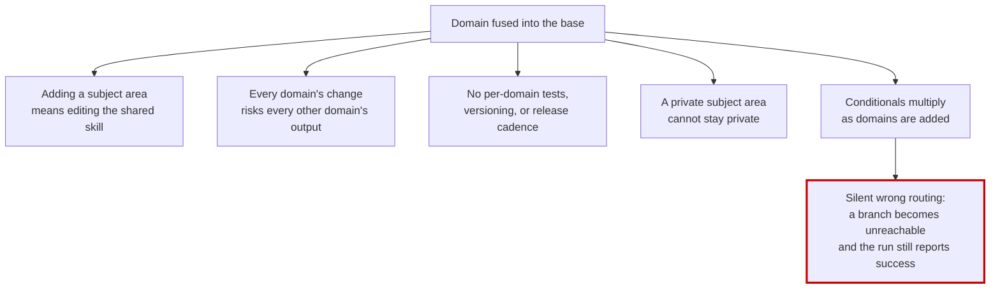

← [wiki index](README.md)

# Why, and what changed

## The problem: fused, not layered

The skill and its first subject area were not layered — they were **fused**. Four concrete symptoms:

**A pipeline picked itself from a filename.** Domain recognition matched the target's *name*. A file
called `karambit-doppler.png` selected one pipeline; `kitchen-knife.png` selected another. Name
similarity is now explicitly banned as a resolution input precisely because it fails silently and
cannot be reasoned about.

**There was no generic path.** Every non-character kind fell through to the weapon track, and that track
failed strict validation unless the spec carried a domain marker. A plain hammer could not be
reconstructed without pretending to be a CS2 skin. "Generic" was not a working path — it was a hole.

**Base code held domain knowledge it had no business holding.** A bone-track domain set inside the
emitter, a 36-line domain quality gate inside the base validator, and a single conditional keyed on
*two* domain names at once (`elif is_character and is_cs2`). That last one is the shape of the whole
problem: a third domain would not have added a branch, it would have multiplied them.

**One subject area owned 34 files** in a repo meant to serve all of them.

## Why that is a correctness problem, not a tidiness problem

When two domains are entangled in one conditional, removing either leaves the other **unreachable or
wrongly reached** — and the run still exits 0 with a plausible answer. That is the failure mode that
makes this structural rather than cosmetic.

**Why not a bigger switch statement, or config flags?** Because that is what the combined conditional
already was, and its failure mode is silence. A flag-driven frame grows combinatorially in the number of
domains, and each new combination is a branch nobody tested. A frame that knows *no* domain has one path
to test, and each domain tests itself in its own repo.

## What the refactor buys

| | |
|---|---|
| A subject area is a **repo**, not a patch to a shared file | it can be private, versioned, released on its own cadence |
| The base has **one job** | reconstruct a reference image into procedural TypeScript, knowing no domain |
| With **no plugin** the frame still completes | it infers from the image — a plugin is optional, not load-bearing |
| A plugin can make the frame **stricter or better-informed** | never looser or different |
| Resolution is by **declared typed edge** | no name matching; ambiguity is refused, not guessed |

## What was *not* traded away

See the table in the [index](README.md#start-here-nothing-was-taken-away). The short version: no
capability moved behind an install, and the generic path is strictly better than before — it now exists.

What moved out is **subject-specific knowledge**, and it comes back with one `img2 add`.

## The three decisions the architecture rests on

1. **One entry point.** There is a single base skill. Plugins do not add entry points; they add
   capability to the one that exists.
2. **Each plugin is its own repo**, installed by a single command, with its own tests that pass without
   the base test tree.
3. **The base pulls; a plugin never pushes.** A plugin publishes declarations and artifacts. The base
   reads them at points it chooses. This is what makes "no plugin installed" a working path rather than a
   broken one.

The consequence worth stating plainly: **installing a plugin never changes a pipeline behind your
back.** A plugin adds steps and gates and raises quality floors. It cannot replace or remove anything.
Replacing is a user action, not a plugin action — see
[Scenario 4](03-cookbook.md#scenario-4).
