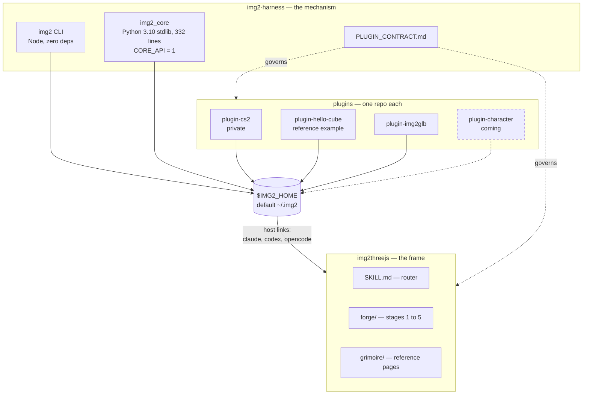
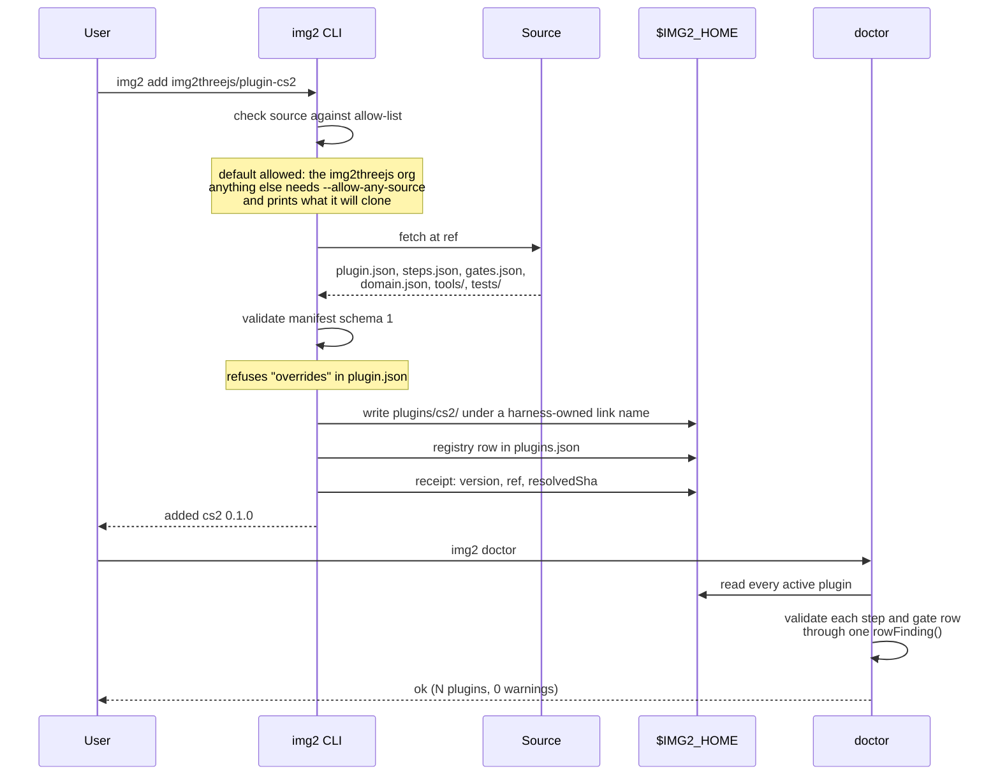
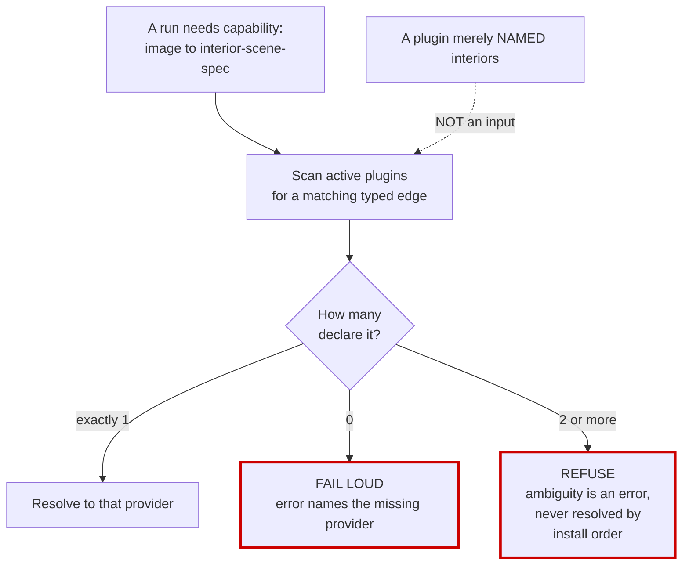
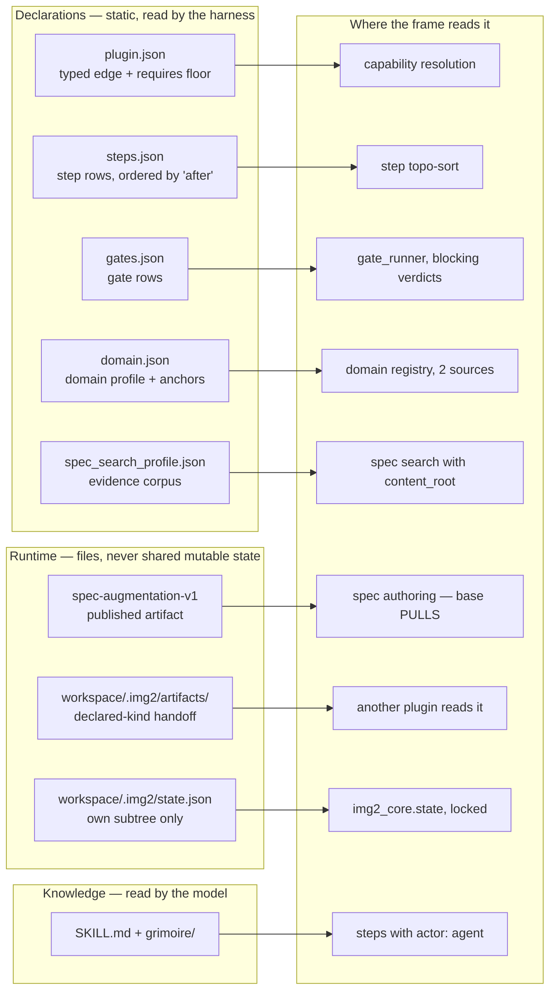
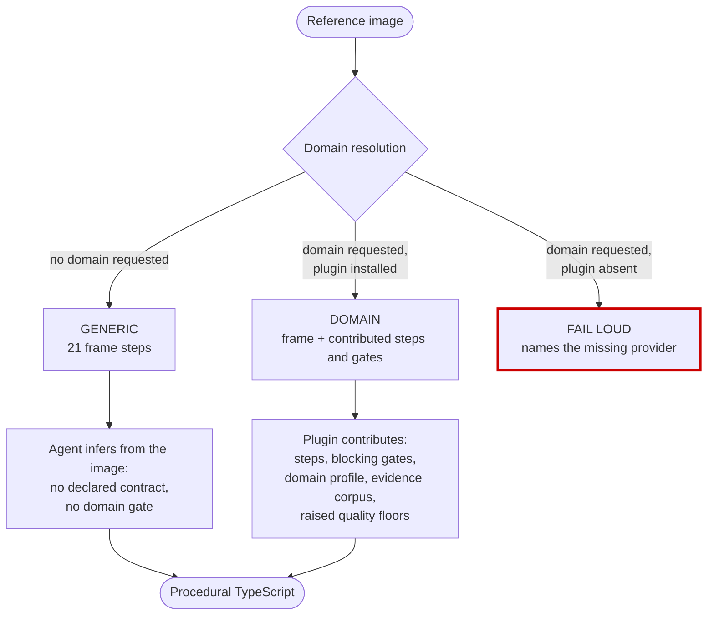
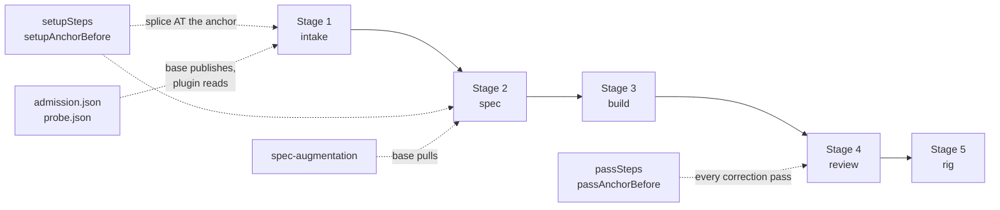
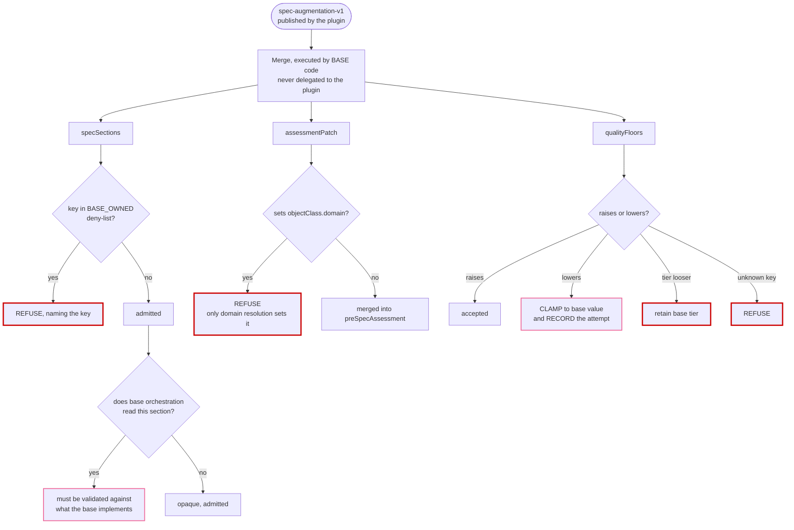
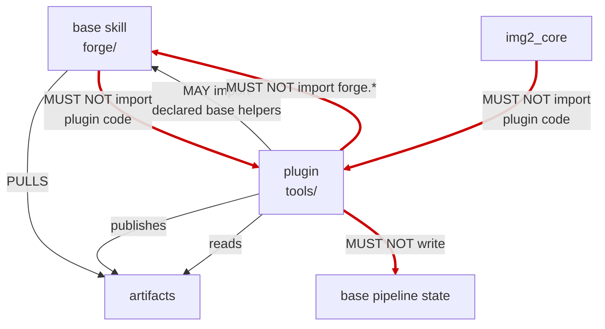
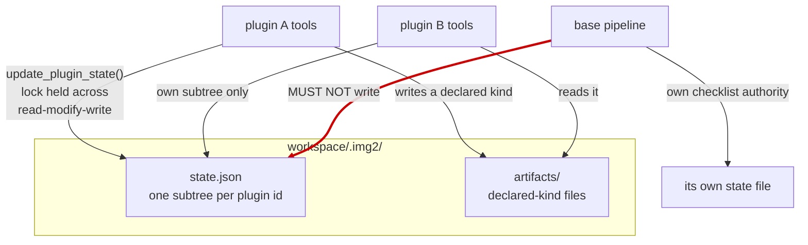

← [wiki index](README.md)

# How it works

Diagram conventions: **solid** = available · **dashed** = coming, do not depend on it yet · **thick
red** = no mechanism or a known gap.

## Repo topology



The harness ships **no domain capability** and the base **names no domain** — so adding a subject area
is adding a repo, not editing two.

## `$IMG2_HOME`, install, and the trust boundary

```
$IMG2_HOME/                  (default ~/.img2)
├── harness/                 the CLI + img2_core, as installed
├── plugins/<name>/          one directory per installed plugin
├── plugins.json             the registry — what is active, and user-owned overrides
├── receipts.json            what was installed, from which ref and sha
└── backups/                 pre-change copies
```



**The threat model, stated honestly in the contract**: a plugin is arbitrary code the agent will later
execute in your workspace. `add` pins (`resolvedSha`), attributes (registry row), and links under a
harness-owned name — *"it cannot make the code safe, only make what runs identifiable and
reproducible."* The harness **never runs plugin tests or imports plugin code** during `add`, `doctor` or
`sync`; validation is static.

`doctor` and the capability query validate rows through **the same function**, `rowFinding()`, so they
cannot drift apart. They once did: the query answered `exit 0` with `problems: []` while handing back a
row whose `argv[0]` was the prose word `Read` — which resolves on a case-insensitive filesystem to
`/usr/bin/read` and exits 0. That silent-success path is why `argv[0]` of a `program` row must be a path
form or one of `python3 python node bash sh`.

## Capability resolution — typed edge, never name



No domain at all is a **valid state**, not an error. Only an *explicit* request for a domain with no
provider fails. A provider declaring several capabilities draws a `doctor` WARN naming the plugin and
its count — visible, but not an error.

## The extension surface



The **domain registry** has exactly two sources: in-repo modules, and installed plugins' `domain.json`
read **through the harness registry** — never by globbing a directory. Ambiguity between the two is
refused rather than resolved by precedence.

## Runtime — one run, three cases



The two paths that produce output differ in **exactness, not completeness**. Generic finishes — and
preserving that is on you: a plugin that makes the generic path stop working has broken the frame's
first principle.

## Where a plugin splices in



Splicing inserts your steps **immediately before** the anchored base step. An anchor naming a base step
that does not exist fails loud — the alternative, appending at the end, would put a setup step after the
steps that depend on it. Step ids to anchor against are listed in
[the cookbook](03-cookbook.md#anchors).

## The augmentation merge, and every refusal



`BASE_OWNED` = `qualityContract`, `preSpecAssessment`, `pipelineRouting`, `sourceImage`, `targetName`,
`localSpecSearch`. **Raise-only is the security property**, stated in the module itself: *a plugin must
never be able to lower the bar it was installed to raise.*

## Boundaries — who may read, import, write



**Gap — the base-import prohibition is not in the contract yet.** The only `MUST NOT import` clause
binds *plugin tools* and *`img2_core`*; none binds the base itself. The thick edge from `base` to
`plugin` is the rule the architecture assumes and the document does not yet state. See
[gaps](04-reference.md#gaps).

## Workspace state — one file per owner



The base pipeline is **not** a plugin: it has no `_img2_local.py`, cannot import `img2_core`, and must
not write `state.json`. Its own delegation record belongs in its own state file.
