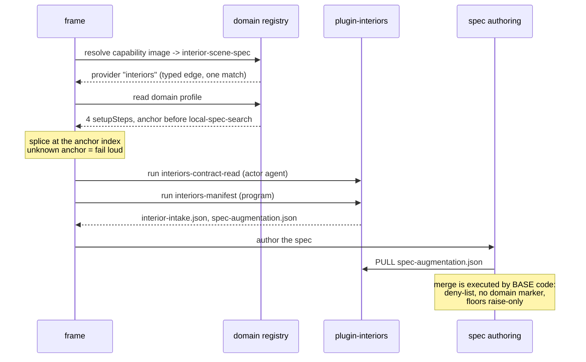
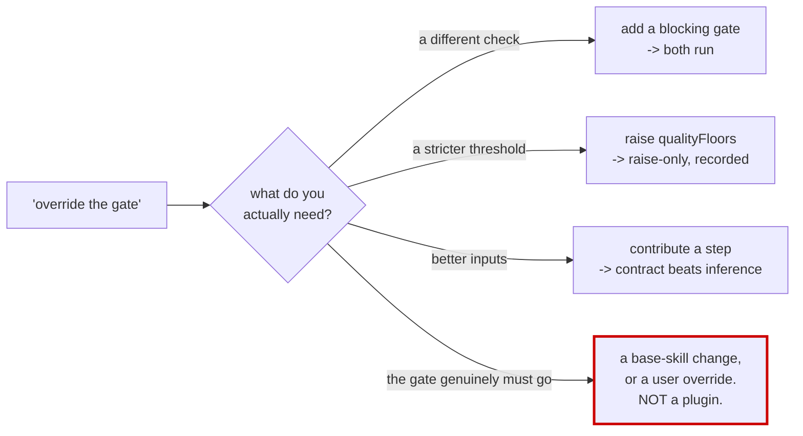

← [wiki index](README.md)

# Cookbook

Organised by what you are trying to do. Every anchor id, field name and file name below is real — the
base pipeline's step ids are listed in [§ Anchors](#anchors) so you can point at them.

| # | I want to… | short answer |
|---|---|---|
| [1](#scenario-1) | add a whole new subject area | a new plugin repo with `domain.json` |
| [2](#scenario-2) | insert a step **before** an existing base step | `setupAnchorBefore` / `passAnchorBefore` |
| [3](#scenario-3) | add a blocking check of my own | `gates.json` + a verdict envelope |
| [4](#scenario-4) | **override / remove a base gate** | you cannot — three things to do instead |
| [5](#scenario-5) | only raise a quality bar, no new code | `qualityFloors` in the augmentation artifact |
| [6](#scenario-6) | run a step in **every correction pass** | `passSteps`, not `setupSteps` |
| [7](#scenario-7) | ship knowledge, not code | an `actor: agent` step + a grimoire page |
| [8](#scenario-8) | contribute reference material to search | `spec_search_profile.json` + `content_root` |
| [9](#scenario-9) | hand data to another plugin | a declared-`kind` file in `artifacts/` |
| [10](#scenario-10) | add a capability the frame has no opinion about | a typed edge + one step |
| [11](#scenario-11) | develop locally / keep it private | `img2 add --link`, a private repo |
| [12](#scenario-12) | declare an emission target — a whole-file export | `provides` + `deterministic` on a `steps.json` row, selected via `--target` |

---

<a name="scenario-1"></a>
## Scenario 1 — Add a whole new subject area: houses & interiors

You reconstruct rooms and furniture. The frame can already build an arbitrary object from an image, but
it has no idea that a room has a floor plane, that a doorway is ~2 m, or that a sofa's seat height is a
strong scale cue. You want those to be a **declared contract** rather than something the model
re-derives every run.

### The repo

```
plugin-interiors/
├── plugin.json                     required
├── domain.json                     the domain profile: steps + anchors + corpus
├── gates.json                      a blocking scale-plausibility check
├── spec_search_profile.json        your reference corpus
├── steps.json                      (optional — see the note below)
├── SKILL.md                        what the model should know about you
├── grimoire/
│   └── intake/interior_contract.md the page your agent step points at
├── tools/
│   ├── interior_manifest.py
│   ├── emit_spec_augmentation.py
│   └── scale_plausibility.py
└── tests/
    ├── test_manifest.py
    └── test_suite_integrity.py
```

### `plugin.json`

```json
{
  "schema": 1,
  "name": "interiors",
  "version": "0.1.0",
  "description": "Rooms, built-ins and furniture: room-scale contract, scale-cue extraction, material recipes for architectural surfaces, and a blocking scale-plausibility gate.",
  "capabilities": [
    { "from": "image", "to": "interior-scene-spec" }
  ],
  "requires": { "harness": ">=0.2.1", "coreApi": 1 }
}
```

`capabilities` is the **only** thing resolution matches on. Naming the plugin `interiors` does not make
it resolve for interiors — the typed edge does. Two plugins declaring the same edge is refused, not
ranked.

### `domain.json` — the part that actually splices into the pipeline

```json
{
  "id": "interiors",
  "setupSteps": [
    ["interiors-contract-read",
     "Read {plugin_dir}/grimoire/intake/interior_contract.md completely before writing the manifest"],
    ["interiors-scale-cues",
     "Identify every scale cue visible in the reference (doorway, step riser, outlet, seat height) and record it in scale-cues.json"],
    ["interiors-manifest",
     "python3 {plugin_dir}/tools/interior_manifest.py {reference} --scale-cues scale-cues.json --admission admission.json --probe probe.json --out interior-intake.json"],
    ["interiors-spec-augmentation",
     "python3 {plugin_dir}/tools/emit_spec_augmentation.py --manifest interior-intake.json --out spec-augmentation.json"]
  ],
  "setupAnchorBefore": "local-spec-search",
  "passSteps": [
    ["interiors-scale-review",
     "python3 {plugin_dir}/tools/scale_plausibility.py --spec object-sculpt-spec.json --manifest interior-intake.json --out interiors-review.json"]
  ],
  "passAnchorBefore": "ai-review-recorded",
  "specCollection": "interiors"
}
```

**Why `local-spec-search` is the right anchor.** Your four steps land immediately *before* it, which
puts them after `reference-admission` (so `admission.json` and `probe.json` exist for your manifest to
read) and before `pre-spec-assessment` and `spec-authoring` (so the assessment sees your contract and
spec authoring can pull your `spec-augmentation.json`). Pick an anchor by asking **what must already
exist** and **what must see your output** — not by where it looks tidy.

The registry validates the profile: unknown keys are refused, and `setupSteps` without
`setupAnchorBefore` is an error. An anchor naming a base step that does not exist **fails loud**:

```
WorkflowStateError: profile 'interiors' anchors a step before unknown base step 'vision-analysis'
```

That is deliberate. The alternative — appending at the end — would put your setup step *after* the
steps that depend on it, and the run would fail somewhere confusing instead of here.

### `domain.json` vs `steps.json` — which one?

Both contribute steps, and they are not interchangeable:

| | `domain.json` (`setupSteps` / `passSteps`) | `steps.json` |
|---|---|---|
| ordering primitive | `setupAnchorBefore` / `passAnchorBefore` — a **base** step id | `after: [step-id]` — another **contributed** step id |
| positions relative to base steps | **yes** — that is its whole job | no |
| runs only when your domain is resolved | yes | no, it is active whenever the plugin is |
| use it for | subject-specific work that must sit at a precise point in the pipeline | a capability that is not domain-gated |

For a subject area you want `domain.json`. Use `steps.json` when your step should run regardless of
which domain resolved — see [Scenario 10](#scenario-10).

### What the frame does with it



### Verify it before you trust it

```bash
img2 add --link ./plugin-interiors
img2 doctor                    # zero findings, or fix and repeat
python3 -m pytest tests -q     # your suite, standalone, no base test tree

# the important one — the frame must still work WITHOUT you:
IMG2_HOME=$(mktemp -d) python3 -m unittest discover -s forge/tests -p 'test_*.py'
```

That last command is not a formality. A plugin that makes the generic path stop working has broken the
frame's first principle, and it is the single easiest thing to break by accident.

---

<a name="scenario-2"></a>
## Scenario 2 — Insert a step *before* an existing base step

This is the question people ask most, and the answer depends on which "before" you mean.

### Before a **base** step → `setupAnchorBefore` / `passAnchorBefore`

Splicing is by anchor, and the anchor means *immediately before this base step*.

```json
{
  "id": "interiors",
  "setupSteps": [["interiors-scale-cues", "…"]],
  "setupAnchorBefore": "image-analysis"
}
```

That lands your step before the very first base step. Common anchors and what they buy you:

| you want to run… | anchor |
|---|---|
| before anything else, including the reference read | `image-analysis` |
| after admission, before local search / assessment / authoring | `local-spec-search` |
| right before the spec is authored | `spec-authoring` |
| right before strict validation | `strict-validation` |
| before the AI vision review, on **every** correction pass | `ai-review-recorded` (in `passSteps`) |
| before the pass gate decides, on every pass | `pass-gate-check` (in `passSteps`) |

### Before another **contributed** step → `after` in `steps.json`

`after` expresses only "after X", so you order your own steps by making the later one depend on the
earlier:

```json
[
  { "id": "my-fetch",   "title": "…", "actor": "program", "command": "…", "after": [] },
  { "id": "my-analyse", "title": "…", "actor": "program", "command": "…", "after": ["my-fetch"] }
]
```

`after` may name **another plugin's** step id — that is supported and is how two plugins cooperate. A
cycle or an unknown reference is a `doctor` error, never a guessed order.

### What you cannot do

There is **no `before` field** in `steps.json`, and no way for a plugin to make a *base* step depend on
a contributed one. If you need to run before a base step, use the anchor. If the base step you need to
precede is inside a phase you have no anchor into, say so in an issue — do not try to fake it with
ordering tricks.

---

<a name="scenario-3"></a>
## Scenario 3 — Add a blocking check of my own

A gate is a CLI: input by argv, exactly **one** verdict envelope on stdout.

### `gates.json`

```json
[
  {
    "id": "interiors-scale-plausible",
    "command": "python3 {plugin_dir}/tools/scale_plausibility.py --spec object-sculpt-spec.json --manifest interior-intake.json",
    "blocking": true,
    "after": []
  }
]
```

### The tool

```python
#!/usr/bin/env python3
"""Refuse a scene whose derived scale contradicts its own scale cues."""
import argparse, json, sys

def main() -> int:
    ap = argparse.ArgumentParser()
    ap.add_argument("--spec", required=True)
    ap.add_argument("--manifest", required=True)
    ap.add_argument("--workspace", default=".")     # never the checkout root
    args = ap.parse_args()

    reasons = []
    try:
        spec = json.load(open(args.spec))
        manifest = json.load(open(args.manifest))
    except (OSError, json.JSONDecodeError) as exc:
        # could not evaluate -> error, NOT a fail, NOT a pass
        print(json.dumps({
            "kind": "img2.gate-verdict", "version": 1,
            "gate": "interiors-scale-plausible", "plugin": "interiors",
            "status": "error", "reasons": [f"unreadable input: {exc}"], "evidence": {},
        }))
        return 2

    doorway = manifest.get("scaleCues", {}).get("doorwayHeightM")
    derived = spec.get("sceneScale", {}).get("doorwayHeightM")
    if doorway and derived and abs(derived - doorway) / doorway > 0.15:
        reasons.append(f"doorway height {derived} m contradicts the measured cue {doorway} m by >15%")

    status = "pass" if not reasons else "fail"
    print(json.dumps({
        "kind": "img2.gate-verdict", "version": 1,
        "gate": "interiors-scale-plausible", "plugin": "interiors",
        "status": status, "reasons": reasons,
        "evidence": {"measured": doorway, "derived": derived},
    }))
    return 0 if status == "pass" else 1

if __name__ == "__main__":
    sys.exit(main())
```

Three rules that decide whether your gate is trustworthy:

- **Exit code carries the verdict**: `0` pass, `1` fail (evaluated, verdict negative), `2` error or
  refused (could not evaluate). Do not conflate 1 and 2 — "the check says no" and "the check could not
  run" are different facts, and only the second means your gate is broken.
- **A malformed envelope is an `error`, not a pass.** This is what stops a crashed gate from reading as
  green. Do not add a `try/except` that swallows a failure and prints `pass`.
- **`reasons` must be non-empty when `status` is not `pass`.** A refusal with no reason is unactionable.

`blocking: true` **stops the workflow — LIVE**, executed from the base's own checklist, not merely
declared. `blocking: false` records the verdict and continues either way, so use it while you are still
calibrating.

**When the base runs them.** A `plugin-gates` step is the base's own `FINAL_STEPS` row (right after the
emission-target step), invoked by the agent like any other checklist step:
`python3 forge/stage3_build/run_gates.py --workspace .`. It runs every installed plugin's gates that
are **involved** in the current workspace, under the two-clause participation rule: (i) you contributed
a step to the resolved domain profile (your `domain.json`, owned by your own registry entry — derived
from the registry layout, never assumed from a name match) and at least one of those steps is marked
done; or (ii) you are the plugin recorded as the selected emission target (Scenario 12). A plugin that
contributed no step to either runs no gates. A blocking failure from ANY involved plugin stops the
whole `plugin-gates` run, naming the gate and the plugin that owns it. You can still exercise your own
gates directly before shipping — `python3 -m img2_core.gate_runner --plugin-dir <your repo> --workspace
<tmp>` — but a normal pipeline run now exercises them too.

---

<a name="scenario-4"></a>
## Scenario 4 — "I want to override / remove a base gate"

**You cannot, and this is deliberate.** The reasoning is one sentence: if a plugin could override a
gate, then *installing a plugin could switch off a quality check and nothing would say so.* The contract
states the consequence directly — *"installing or upgrading a plugin therefore never changes a
pipeline."*

| | |
|---|---|
| Plugin replaces a base step or gate | **No** |
| Plugin declares an override about itself or another plugin | **No** — `plugin.json` has no override field and MUST NOT gain one |
| User replaces a step or gate | reserved as `overrides` in `plugins.json` — **not implemented** |
| Harness behaviour today | refuses `overrides` in a plugin manifest; a harness that does not implement the mechanism must FAIL on the key, never proceed as if the pipeline were unmodified |

Even once implemented, two rules are already fixed: an override value is a **reference to an existing
row, never an inline command** (an inline command would bypass the placeholder and metacharacter
checks), and `overrides` is **user-owned data** that any registry-rewriting command must preserve
verbatim and report.

### What to do instead

Almost every real "I need to override the gate" turns out to be one of these three:

**(a) The base gate is not the check I need → add yours alongside.** Both run. Yours can be stricter,
subject-specific, and blocking. The base gate is not in your way; it is checking something else.

**(b) The base threshold is too lax for my subject → raise the floor.** See
[Scenario 5](#scenario-5). Raise-only, recorded, attributed to your plugin and version.

**(c) The base step improvises badly for my subject → contribute a step with a declared contract.** The
frame defers to a declared contract over its own inference. You are not replacing the step; you are
removing the need for it to guess.



If it really is (d) — the gate must not exist for anyone — that is a change to the base skill. Open an
issue arguing why. Routing around a gate from a plugin is the one thing this architecture is built to
prevent.

---

<a name="scenario-5"></a>
## Scenario 5 — Only raise a quality bar, no new steps or gates

Publish a `spec-augmentation-v1` artifact carrying just `qualityFloors`. The base **pulls** it during
spec authoring; the merge runs in base code and is never delegated to you.

```json
{
  "kind": "spec-augmentation-v1",
  "provider": "interiors",
  "version": "0.1.0",
  "qualityFloors": {
    "targetMinDetails": 24,
    "strictnessTier": "complex"
  }
}
```

What the merge does with it:

| you propose | result |
|---|---|
| a number **above** the base value | accepted |
| a number **below** the base value | **clamped to the base value, and your attempt is recorded** |
| a tier **stricter** than the base | accepted |
| a tier **looser** than the base | base tier retained |
| a key the base does not know | **refused**, naming the key |

Tier order, loosest to strictest: `simple → moderate → complex → ultra-complex`.

Every accepted change is attributed to the provider and version that proposed it, so a run's quality bar
can be explained afterwards instead of inferred from whatever happens to be installed.

Two things the artifact may **not** carry: any key in `BASE_OWNED` (`qualityContract`,
`preSpecAssessment`, `pipelineRouting`, `sourceImage`, `targetName`, `localSpecSearch`) inside
`specSections`, and `objectClass.domain` via `assessmentPatch` — only domain resolution sets that.

---

<a name="scenario-6"></a>
## Scenario 6 — Run a step in every correction pass

`setupSteps` run **once**. `passSteps` run **in every correction pass** — which is what you want for a
review or measurement that has to be re-taken after each correction.

```json
{
  "passSteps": [
    ["interiors-scale-review",
     "python3 {plugin_dir}/tools/scale_plausibility.py --spec object-sculpt-spec.json --out interiors-review.json"]
  ],
  "passAnchorBefore": "ai-review-recorded"
}
```

Put it before `ai-review-recorded` when your measurement should inform the AI review, or before
`pass-gate-check` when it should inform the continue/stop decision.

Correction loops have ceilings the base counts from the spec's own review history — `maxPerPass` and
`maxTotal`. On breach the run reports `status: stopped` with a `stopReason` and exits non-zero. **A
plugin does not get to raise these.** If your subject genuinely needs more passes, that is a
conversation about the base's ceilings, not a value you can set.

---

<a name="scenario-7"></a>
## Scenario 7 — Ship knowledge, not code

The most under-used extension point. A plugin can contain **zero executable tools** and still be
valuable: one `actor: agent` step plus a reference page.

```json
{
  "setupSteps": [
    ["interiors-contract-read",
     "Read {plugin_dir}/grimoire/intake/interior_contract.md completely before writing the manifest"]
  ],
  "setupAnchorBefore": "local-spec-search"
}
```

`actor: agent` means the row is an instruction to the model, not a command. It is returned as an
`instruction` with **no `argv` key at all**, and nothing is executed — so the `argv[0]` and
metacharacter rules do not apply.

**Set `actor` explicitly on every prose row.** The default is `program`, and a prose sentence handed to
an executor is how `Read the contract` once resolved to `/usr/bin/read` on a case-insensitive filesystem
and exited 0 — a silent success that looked like a completed step. An unknown `actor` is refused, not
defaulted.

This is how `plugin-cs2` starts: its first contributed step's entire job is *"read this contract page
completely before creating or validating the manifest."*

---

<a name="scenario-8"></a>
## Scenario 8 — Contribute reference material to spec search

```json
{
  "id": "interiors",
  "collections": [
    {
      "name": "interiors",
      "content_root": "{plugin_dir}/corpus",
      "include": ["**/*.md", "**/*.json"]
    }
  ]
}
```

and in `domain.json`: `"specCollection": "interiors"`.

`content_root` names a second permitted root the registry vouched for. The containment guard still
applies: no absolute paths, no `..`, and an `lstat` per path component. You are widening *where* the
base may read, not disabling the check that it stays inside.

Use this when your subject has canonical reference material — dimension standards, material catalogues,
naming conventions — that a step should search rather than a model should recall.

---

<a name="scenario-9"></a>
## Scenario 9 — Hand data to another plugin

Cross-plugin handoff is **files with declared `kind` identifiers** in `<workspace>/.img2/artifacts/` —
never shared mutable state.

```python
# plugin A writes -- under its OWN subdirectory, never bare in artifacts/
artifact = {"kind": "interiors.room-envelope-v1", "version": 1, "rooms": [...]}
(workspace / ".img2" / "artifacts" / "interiors" / "room-envelope.json").write_text(json.dumps(artifact))
```

That per-plugin subdirectory is not a style choice: `<workspace>/.img2/artifacts/<plugin-id>/` is the
same containment rule an emission target's declared `provides.artifact.path` is held to (Scenario 12) —
it is what keeps two plugins' outputs from colliding.

```python
# plugin B reads — and checks the kind, because a file name is not a contract
data = json.loads(path.read_text())
if data.get("kind") != "interiors.room-envelope-v1":
    raise SystemExit(f"unexpected artifact kind: {data.get('kind')!r}")
```

For your **own** state, `<workspace>/.img2/state.json` has one subtree per plugin id, and you touch only
yours:

```python
from img2_core.state import update_plugin_state
update_plugin_state(workspace, "interiors", lambda s: {**s, "roomsMeasured": 4})
```

Mutate **only** through `update_plugin_state`, which holds the lock across the whole
read-modify-write. A separate load → mutate → save with the lock held only at save is a lost-update bug,
and the contract names it as one.

Tools take `--workspace`, defaulting to cwd — **never** the skill or checkout root. A tool that writes
into the checkout is writing into somebody's git working tree.

---

<a name="scenario-10"></a>
## Scenario 10 — Add a capability the frame has no opinion about

Not every plugin is a subject area. `plugin-img2glb` is the shape here: it adds an ability the frame
never had and that no domain gates.

Use `steps.json` rather than `domain.json`, because the step should run whenever the plugin is active
rather than only when a domain resolves:

```json
[
  {
    "id": "glb-export",
    "title": "Export the built factory to GLB",
    "actor": "program",
    "command": "node {plugin_dir}/tools/export_glb.mjs --workspace {workspace} --out export.glb",
    "after": []
  }
]
```

Declare a typed edge that says what you convert:

```json
"capabilities": [{ "from": "threejs-factory", "to": "glb-asset" }]
```

**This is not an emission target, and "runs whenever the plugin is active" does not describe one.** A
`steps.json` capability like this one is invoked by whatever the frame's own steps do with it — here,
an agent choosing to run the export tool because the plugin is installed and the edge exists. An
emission target (Scenario 12) is a *different* thing wearing similar clothes: it is declared with a
`provides` row whose `from` is `sculpt-spec`, and — regardless of installation — it never runs unless a
user names it via `--target <kind>`. If your capability is "convert the object into another format,"
ask which one you actually have: does it run because an agent decided to, given the edge exists (this
scenario), or does it run only on an explicit `--target` request naming it, terminal and bounded
(Scenario 12)? The two are not interchangeable, and the wiki has taught only the first shape until now.

---

<a name="scenario-11"></a>
## Scenario 11 — Develop locally, and keep it private

```bash
img2 add --link ./plugin-interiors     # symlink a local checkout; no clone
img2 doctor                             # iterate until zero findings
img2 remove interiors                   # deletes the row, and any user overrides on it
```

**Private is a first-class case.** `plugin-cs2` is a private repo, and nothing in the frame requires a
plugin to be public — that was one of the reasons for the split. Installing from outside the default
`img2threejs` org needs `--allow-any-source`, which prints what it is about to clone before it does.

The harness **never runs your tests or imports your code** during `add`, `doctor` or `sync` — validation
is static. What `add` does give you is provenance: a pinned `resolvedSha`, a registry row, and a link
under a harness-owned name. The contract is honest about the limit: *"it cannot make the code safe, only
make what runs identifiable and reproducible."*

---

<a name="scenario-12"></a>
## Scenario 12 — Declare an emission target: a whole-file export

You want the frame's already-validated sculpt spec turned into a different produced file — a GLB, an
FBX, or here, a minimal deterministic JSON echo of the spec's own shape. This is **not** a domain (you
are not teaching the frame about a subject) and not an ordinary `steps.json` capability (Scenario 10):
it never runs merely because you are installed. It runs once, terminally, and only when a user asks
for it by name.

### The repo — `plugin-sculpt-echo`, the in-tree fixture that proves this end to end

```
plugin-sculpt-echo/
├── plugin.json          required — the discovery edge
├── steps.json           the provides row: invocation + artifact
├── gates.json           a blocking structure check on YOUR artifact
├── SKILL.md
└── tools/
    ├── emit_echo.py      writes the artifact
    └── gate_echo_structure.py
```

### `plugin.json` — discovery only

```json
{
  "schema": 1,
  "name": "sculpt-echo",
  "version": "0.1.0",
  "description": "Emission-target contract exerciser: echoes a validated sculpt spec's shape to a deterministic JSON artifact (sculpt-spec -> echo).",
  "capabilities": [{ "from": "sculpt-spec", "to": "echo" }],
  "requires": { "harness": ">=0.1.0", "coreApi": 1 }
}
```

The `from` of `sculpt-spec` is what makes this a **target edge** rather than an ordinary capability —
it names the frame's own validated-spec artifact kind as the source, which nothing but an emission
target declares. The edge still serves discovery only, exactly as any other capability does; it is not
itself an invocation surface.

### `steps.json` — invocation and artifact, on the providing step

```json
[
  {
    "id": "emit-echo",
    "title": "Echo the validated sculpt spec's shape to a deterministic artifact",
    "actor": "program",
    "command": "python3 {plugin_dir}/tools/emit_echo.py --spec {spec} --workspace {workspace}",
    "after": [],
    "provides": {
      "version": 1,
      "from": "sculpt-spec",
      "to": "echo",
      "artifact": { "kind": "echo", "path": ".img2/artifacts/sculpt-echo/echo.json" }
    },
    "deterministic": true
  }
]
```

Three things that are easy to get wrong on a first attempt, each cost real time when this fixture was
authored from the wiki alone:

- **`provides.artifact.path` is the FULL workspace-relative path, already prefixed with
  `.img2/artifacts/<your-plugin-id>/`** — not a bare filename relative to that directory. Declaring
  `"echo.json"` alone is refused: `doctor` names exactly what it must resolve under.
- **`deterministic` and the optional `timeoutSeconds` are siblings of `provides` on the SAME row**, not
  nested inside it. `deterministic` is required — `true` here, because a pure function of the spec's
  own content is exactly what this fixture is.
- **`{spec}` and `{workspace}` are left for the caller to fill by value**, same as any `steps.json`
  command — this row is invoked by the base's own socket, never by an agent directly, so there is no
  `{plugin_dir}`-only convenience path here the way a domain-contributed step sometimes has.

### `gates.json` — your artifact gets your own gate, like any other capability

```json
[
  { "id": "echo-structure", "command": "python3 {plugin_dir}/tools/gate_echo_structure.py --workspace {workspace}", "blocking": true, "after": [] }
]
```

This runs under the same participation rule as any other gate (Scenario 3): whenever your providing
step ran as the workspace's selected target. It checks *your own* artifact's shape — the base's own
verification (existence, size, location, and container check where one exists) is separate and does
not depend on your gate passing.

### Selecting it

```bash
img2 add --link ./plugin-sculpt-echo
img2 doctor                                    # zero findings
img2 capabilities --from-kind sculpt-spec --to-kind echo --json   # resolves to sculpt-echo

# from the base, once the workspace has reached action-ready:
python3 forge/stage3_build/emit_target.py --spec object-sculpt-spec.json --workspace "$PWD" --target echo
```

Nothing here runs merely because the plugin is installed. With no `--target`, the export step is a
no-op that writes nothing and names `src/createObjectModel.ts` as the artifact of record — installing
`plugin-sculpt-echo` and never selecting `echo` changes not one byte of the default output.

### What the base warrants, and what it does not

The produced `echo.json` carries provenance — the spec's content hash, `sculpt-echo`'s own id, version
and `resolvedSha`, the harness version, and the `deterministic: true` declaration (verified once per
spec-and-revision, by double-invocation, then cached). The base verifies existence, size and location
always, and the declared kind's container shape where a prober exists — `echo` has none, so it is
accepted on existence/size/location alone, with the verification level stating plainly that kind
verification was not performed. **No further base quality warranty applies.** `echo.json` is never
reported under the completion vocabulary a gated TypeScript build uses — its own gate (`echo-structure`)
is the only quality claim it carries, and that claim is `sculpt-echo`'s, not the base's.

### Verify it before you trust it

```bash
img2 add --link ./plugin-sculpt-echo
img2 doctor                                     # zero findings, or fix and repeat
python3 -m unittest discover -s tests -p 'test_*.py'   # your suite, standalone

# the round-trip that actually proves it, run from the base:
img2 add --link ./plugin-sculpt-echo && img2 doctor && \
  python3 forge/stage3_build/emit_target.py --spec <spec> --workspace "$PWD" --target echo
git status --porcelain      # empty: installing and running a target changed no base file
```

That last line is not a formality — it is the mechanical form of "a v1.7 exporter installs, resolves,
runs and is verified with zero base changes." A target plugin that leaves the base repo dirty has
broken the one property this whole contract exists to prove.

---

<a name="anchors"></a>
## Anchors — the base pipeline's step ids

Splice targets for `setupAnchorBefore` and `passAnchorBefore`. An anchor outside this list fails loud.

**Setup phase, runs once (11):**

`image-analysis` → `reference-suitability` → `reference-admission` → `local-spec-search` →
`pre-spec-assessment` → `detail-inventory` → `projection-route` → `spec-authoring` →
`material-evidence` → `material-spec-wiring` → `strict-validation`

**Correction pass, runs every pass (8):**

`build-current-pass` → `render-capture` → `review-contract-read` → `tier1-diagnostics` →
`multi-angle-review` → `pass-gate-check` → `ai-review-recorded` → `pipeline-sync`

**Final (2):** `part-coverage` → `action-ready`

21 steps generic; contributed steps add to that count rather than replacing any of it.

---

## Anything else?

Cases this cookbook does **not** cover, because there is no mechanism:

| you want | status |
|---|---|
| remove or replace a base step or gate | no mechanism — [Scenario 4](#scenario-4) |
| reorder base steps among themselves | no mechanism |
| two plugins providing the same typed edge | refused as ambiguous, by design |
| raise the correction-loop ceilings | not a plugin-settable value |
| make the base import your code | forbidden; the base pulls artifacts instead |
| a pass id outside the base's set | ~~accepted today, and it should not be~~ **refused, closed** — see [gaps](04-reference.md#gaps) |

That last row was a live bug, now closed: `VALID_PIPELINE_PASS_IDS` gained its first consumers, so a
pass named outside the base's set is refused rather than silently accepted. The residual — a genuinely
visual pass renamed to a legal-but-non-visual id still validates while dropping its visual gate — is
deferred hygiene (`VISUAL_PASS_IDS`/`DEFAULT_PASS_ORDER` dedup), not a mechanism gap; see the gap entry.
